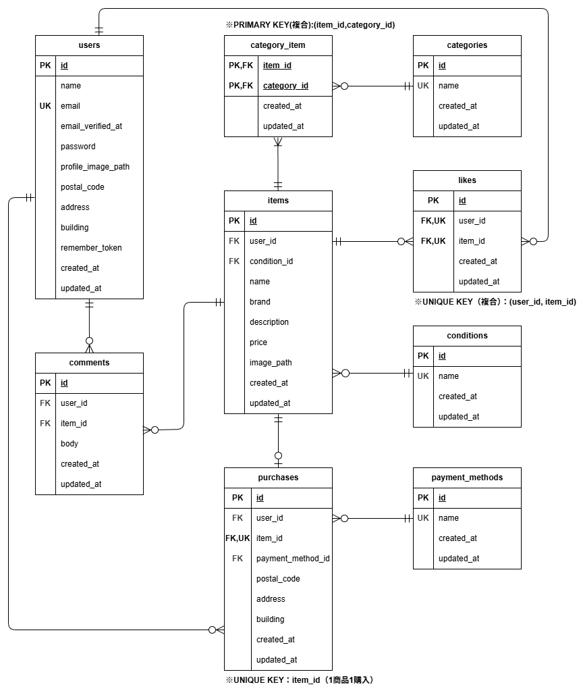

# coachtechフリマ

## アプリ概要
coachtechフリマは、商品の出品・閲覧・購入ができるフリマアプリです。  
会員登録、ログイン、メール認証、商品出品、商品詳細表示、いいね、コメント、購入、プロフィール編集などの機能を実装しています。

---

## 主な機能
- 会員登録 / ログイン / ログアウト
- メール認証
- 商品一覧表示
- マイリスト表示
- 商品検索
- 商品詳細表示
- いいね機能
- コメント機能
- 商品出品機能
- 商品購入機能
- 送付先住所変更
- プロフィール編集
- 購入商品一覧 / 出品商品一覧表示

---

## 使用技術（実行環境）
- PHP 8.1.34
- Laravel 8.83.29
- MySQL 8.0.26
- nginx 1.21.1
- JavaScript（Vanilla JS）
- Docker / Docker Compose
- HTML / CSS（Bladeテンプレート）

## 開発・テスト・外部サービス
- PHPUnit
- Stripe
- MailHog

---

## 環境構築

### Dockerビルド
1. リポジトリをクローン
```bash
git clone https://github.com/yakhrc5/coachtech_freamarket.git
```

2. 作業ディレクトリに移動
```bash
cd coachtech_freamarket
```

3. Docker Desktopを起動
4. Dockerコンテナをビルドして起動
```bash
docker compose up -d --build
```

### Laravel環境構築
1. PHPコンテナに入る
```bash
docker compose exec php bash
```

2. パッケージをインストール
```bash
composer install
```

3.  `.env` ファイルを作成
```bash
cp .env.example .env
```

4. アプリケーションキーの作成
``` bash
php artisan key:generate
```

5. シンボリックリンクを作成
```bash
php artisan storage:link
```

6. マイグレーションの実行
``` bash
php artisan migrate
```

7. シーディングの実行
``` bash
php artisan db:seed
```

8. storage / bootstrap/cache の権限を設定
```bash
chown -R www-data:www-data storage bootstrap/cache
chmod -R 775 storage bootstrap/cache
```

### Stripe設定について
購入機能には Stripe を使用しています。  
動作確認には、Stripe の公開キー / シークレットキーを設定してください。

``` env
STRIPE_KEY=your_stripe_public_key
STRIPE_SECRET=your_stripe_secret_key
```
Stripe テストカード番号（公式）  
`4242 4242 4242 4242`

---

## URL
- 開発環境: http://localhost/
- phpMyAdmin: http://localhost:8080/
- MailHog: http://localhost:8025/

## ログイン情報
本アプリは一般ユーザー向けフリマアプリであり、管理者ユーザーは実装していません。

### 一般ユーザー
以下のユーザーでログインできます。

- メールアドレス: `test@example.com`
- パスワード: `password`

※ 上記ユーザーはシーディングで登録されます。

---

## テスト環境構築
テスト実行時は `.env.testing` の設定を使用します。  
テスト用データベースとして `flea_market_testing` を利用します。

※ 以下のコマンドは、プロジェクトルートでホスト側から実行してください。

1. `.env.testing` ファイルを作成
```bash
cp src/.env.testing.example src/.env.testing
```

2. テスト用データベースを作成
```bash
docker compose exec mysql mysql -uroot -proot -e "CREATE DATABASE IF NOT EXISTS flea_market_testing;"
```

3. テスト用アプリケーションキーの作成
``` bash
docker compose exec php php artisan key:generate --env=testing
```

4. テストの実行
``` bash
docker compose exec php php artisan test
```

---

## ER図

