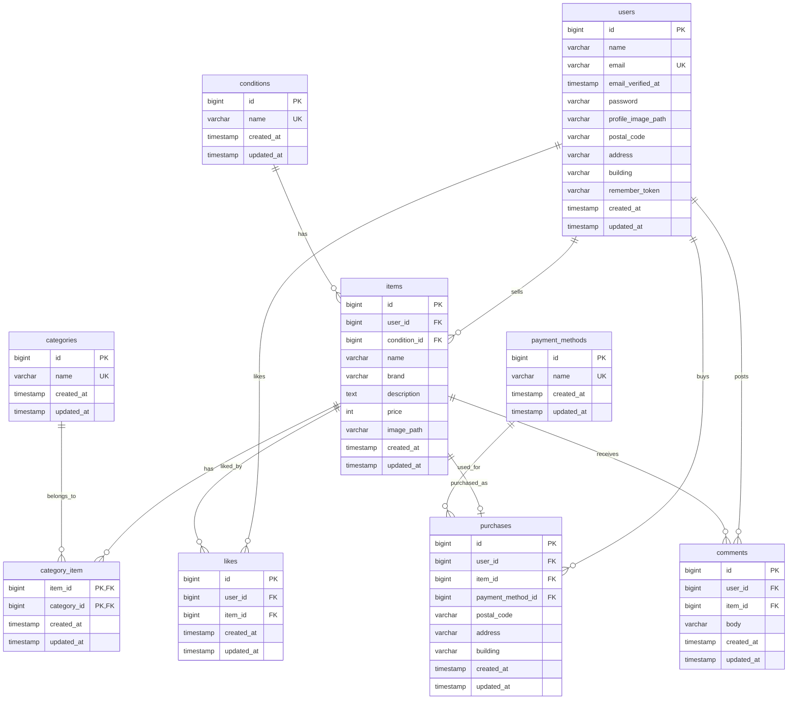

```mermaid
erDiagram
    users {
        bigint id PK
        varchar name
        varchar email UK
        timestamp email_verified_at
        varchar password
        varchar profile_image_path
        varchar postal_code
        varchar address
        varchar building
        varchar remember_token
        timestamp created_at
        timestamp updated_at
    }

    conditions {
        bigint id PK
        varchar name UK
        timestamp created_at
        timestamp updated_at
    }

    categories {
        bigint id PK
        varchar name UK
        timestamp created_at
        timestamp updated_at
    }

    items {
        bigint id PK
        bigint user_id FK
        bigint condition_id FK
        varchar name
        varchar brand
        text description
        int price
        varchar image_path
        timestamp created_at
        timestamp updated_at
    }

    category_item {
        bigint item_id PK, FK
        bigint category_id PK, FK
        timestamp created_at
        timestamp updated_at
    }

    likes {
        bigint id PK
        bigint user_id FK
        bigint item_id FK
        timestamp created_at
        timestamp updated_at
    }

    comments {
        bigint id PK
        bigint user_id FK
        bigint item_id FK
        varchar body
        timestamp created_at
        timestamp updated_at
    }

    purchases {
        bigint id PK
        bigint user_id FK
        bigint item_id FK
        bigint payment_method_id FK
        varchar postal_code
        varchar address
        varchar building
        timestamp created_at
        timestamp updated_at
    }

    payment_methods {
        bigint id PK
        varchar name UK
        timestamp created_at
        timestamp updated_at
    }

    users ||--o{ items : sells
    conditions ||--o{ items : has

    items ||--o{ category_item : has
    categories ||--o{ category_item : belongs_to

    users ||--o{ likes : likes
    items ||--o{ likes : liked_by

    users ||--o{ comments : posts
    items ||--o{ comments : receives

    users ||--o{ purchases : buys
    items ||--o| purchases : purchased_as
    payment_methods ||--o{ purchases : used_for
```